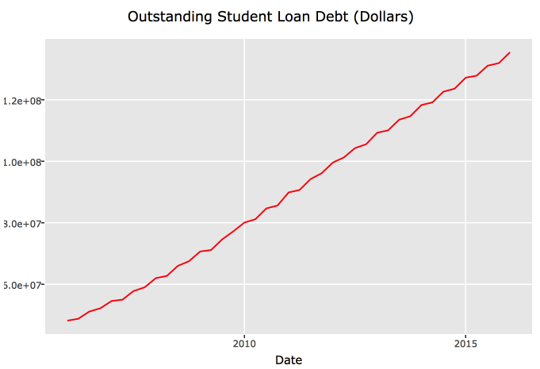
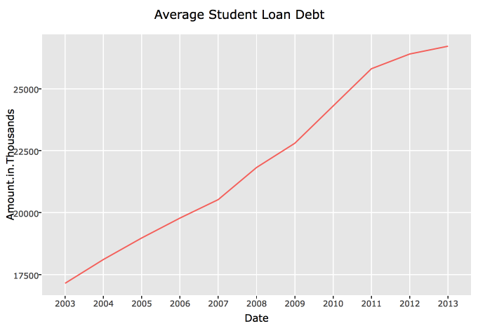
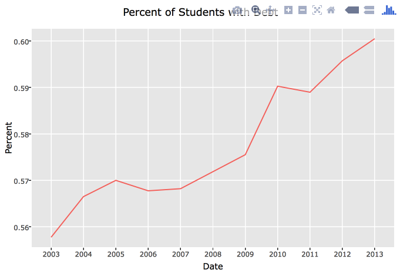
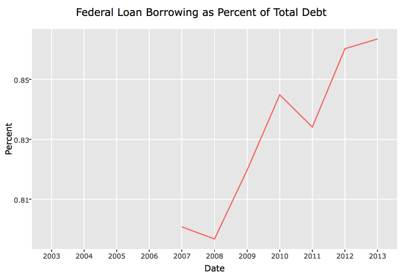
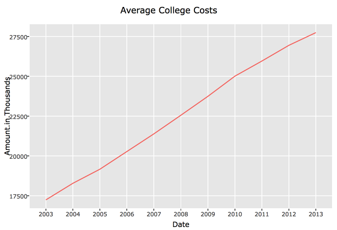

#Are subprime student loans a time-bomb for the US government?

Many of you may be aware that there is an outstanding student loan debt problem in the US. As of 2015, there is 1.3 trillion dollars in outstanding student loan debt and this number has increased steadily over the past 10 years.

Over the same period, the average debt of graduates has increased to almost $27,000 per graduate and the percentage of graduates with student loan debt has increased to nearly 60%.

###But where is this money coming from?

90% of student loan debt in 2015 was comprised of federal loan borrowing

which accounts for nearly 27% of the US federal government's total assets as reported in the 2015 US Tresury's financial statements. ($845.1B of the $3,229.8B). This is a 3.5% increase since 2014 ($731.2B of $3,065.3B). Although this pails in comparision to the over 21 trillion dollar US deficit, student loans are becoming an ever growing part of the US governments' assets. 

###Is this really a serious problem? 

The short answer is that yes, it could be a very serious problem for a variety of reasons.

  1) Although unemployment rates are stabilizing, many graduates do not go on to have an income that affords the amount of debt they take on from the federal government to attend college and go on to take on higher education that only amplifies this problem
  
  2) Universities have taken advantage of the influx of students and their accessibility to loans and have increased tuition at a rate that far out weighs unemployment recovery and the consumer price index. 
  

  
  3) All student loans are rated AAA, which they cannot possibly be. Because student loan rates have been held so low, federal loan almost always have a lower interest rates than private loans higher interest rates, which promotes borrowers usually prioritize repaying private loans first. Another big difference between federal loans and private loans is that federal loans all have fixed rates, while private loans usually have rates that vary from borrower to borrower based on his or her credit. Unlike private lenders, the federal government doesn’t check credit records for student loan borrowers. This leads to many uncreditworthy borrowers qualifying for loans and then being saddled with debt indefinitely with little hope of paying it back. This has lead to an increasing default rate over the past three years, which surely only brings a portion of the borrowers who can't pay back there loans compared ot many others taking advantage of 
  
  
  
##explain laon forgiveneess and how repayments are delayed

The name “Obama Student Loan Forgiveness” has become the nickname for a program actually called the William D. Ford Direct Loan program. Many people only know about the program, and have heard of it through others as the Obama Student Loan Forgiveness program.The name came about when President Obama reformed part of the Direct Loan program in 2010 by signing the Health Care and Education Reconciliation Act of 2010.

Here are some of the changes that were made by President Obama.

The federal government will no longer give subsidies to private lending institutions for federally backed loans.
Borrowers of new loans starting in 2014 will qualify to make payments based on 10% of their discretionary income.
New borrowers would also be eligible for student loan forgiveness after 20 years instead of 25 on qualifying payments.
Money will be used to fund poor and minority students and increase college funding

##correlate current student loan probelm with mortgage crisis

 This harkens back to the sub-prime housing loans that drove up the housing bubble.

 

