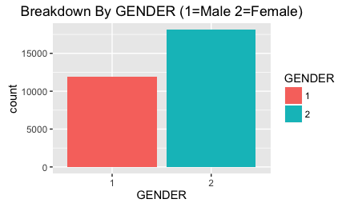
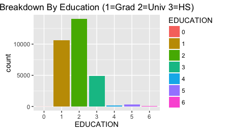
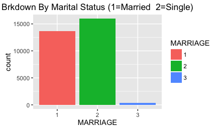
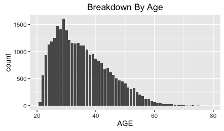
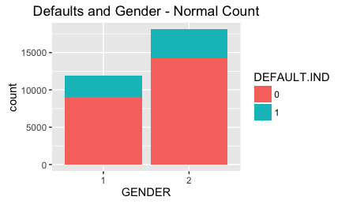
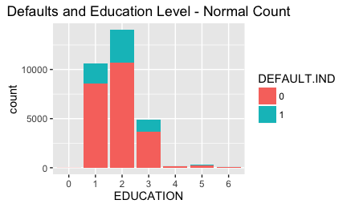
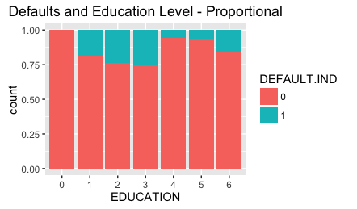
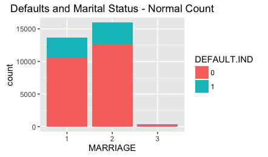
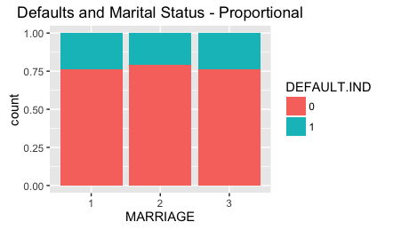
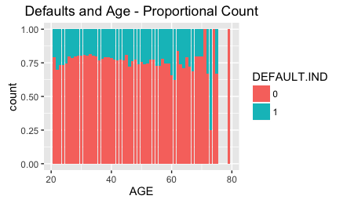

##  

| Is there a relationship between credit card defaults and customer Attributes?

* Gender
* Education Level
- Marital Status
- Age

# Some background on the sample

##

##

##

##

# Relationship between Card Defaults and Attributes

##

##

##

##

##

##

##

# SUMMARY OF FINDINGS

##
* More women borrowers than men
and they seem to have slighter better credit

* Level of education has inverse relationship
to default occurrences

* Default rates seem to rise fast as age increases until early 30s and then starts to slowly decline

* Possible to come up with a model to predict default rates

